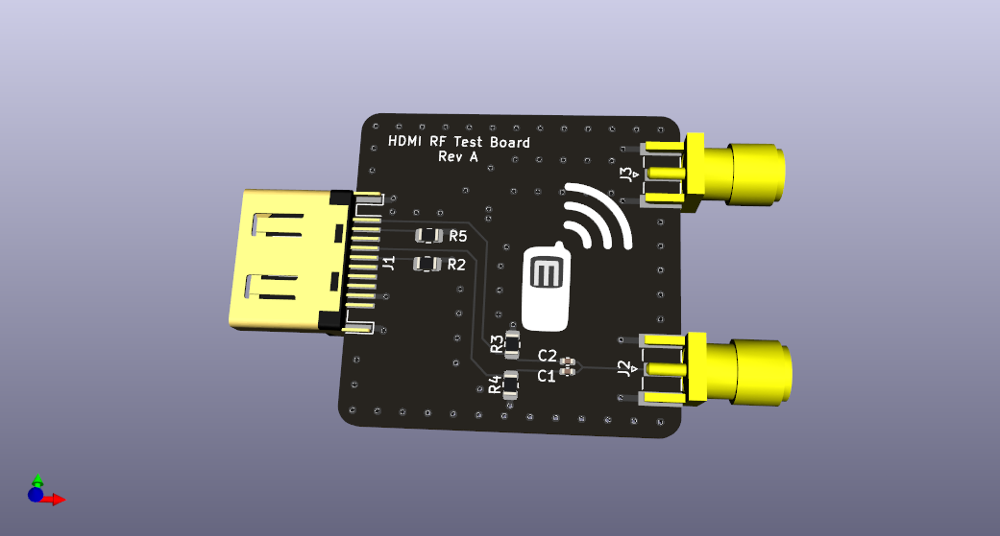

# serdes-rf-hdmi

HDMI test fixture for TMDS to single-ended SMA for RF testing.

This board is designed to test RF input and output using TMDS signals from the
Pynq-Z2 board's HDMI port.  It capacitively couples the clock signal for use
as an NCO (this is used in a single-ended output/input mode).  And it provides
two identical differentially-coupled signals for either RF input or RF output.

The RF signals are filtered by a 4th order Chebyshev bandpass filter.  The
RF is coupled to the TMDS pair via a center-tapped 1:1 RF transformer.  The
center tap is connected to ground via a 50 Ohm resistor.

The filter is designed for the 2m amateur radio band, but can easily be
adapted to other bands of interest.  It is important to have at a minimum
a low-pass filter with the 2λ at down least -40dB to prevent aliasing.

